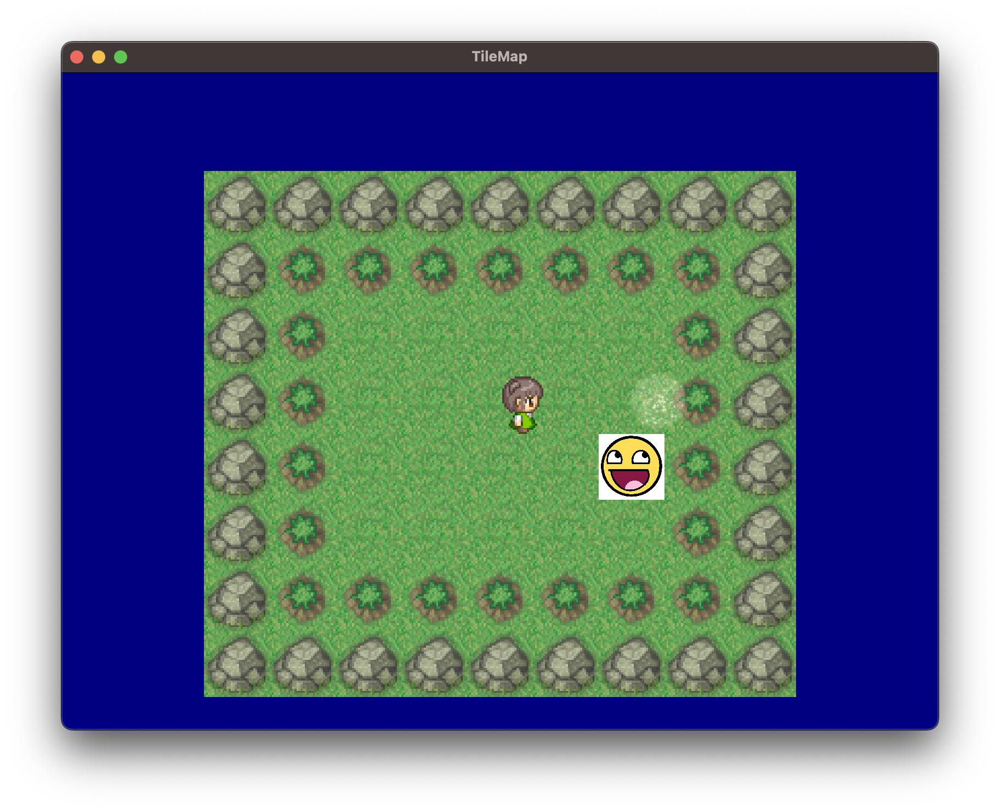

# MiCore2d
MiCore2d is light-weight 2D game engine written by C# and using OpenTK.

## Dependencies

- OpenTK
- SkiaSharp
- StbImageSharp
- NVorbis
- NLayer

## Build

```sh
$ git clone https://github.com/suna66/MiCore2d.git
$ cd MiCore2d
$ dotnet build
```

## Play examples

```sh
$ cd MiCore2d/Examples/${each example folder}
$ dotnet run
```

### Example Image



## Create Nuget package

```sh
$ dotnet pack
```

## Features

- Scene Management
- 2D Graphics System
  - ImageSprite - normal texture sprite
  - PlainSprite - rectangle sharp sprite
  - TilemapSprite - timemap sprite
  - CanvasSprite - SKCanvas sprite
- Components
  - Animation
  - Collider
  - HardBoy
  - Controller
- Audio
  - WAV
  - MP3
  - OGG
- Canvas
  - Line
  - Rectangle
  - Circle
  - String
- Effect
  - Fadein-out
  - Sepia
  - Blur


## Special Thanks

- images
  - GirlTile001.png -  [https://pipoya.net/sozai/](https://pipoya.net/sozai/)
  - explosion.png -  [https://pipoya.net/sozai/](https://pipoya.net/sozai/)
  - magic.png -  [https://pipoya.net/sozai/](https://pipoya.net/sozai/)
  - BrightForest.png -  [http://yms.main.jp/](http://yms.main.jp/)
  - park.jpg - [https://min-chi.material.jp/](https://min-chi.material.jp/)

- sounds
  - sanjinooyatsu.mp3 -  [https://amachamusic.chagasi.com/](https://amachamusic.chagasi.com/)
  - explosion.mp3 -  [https://soundeffect-lab.info/](https://soundeffect-lab.info/)
  - magic.mp3 -  [https://soundeffect-lab.info/](https://soundeffect-lab.info/)
